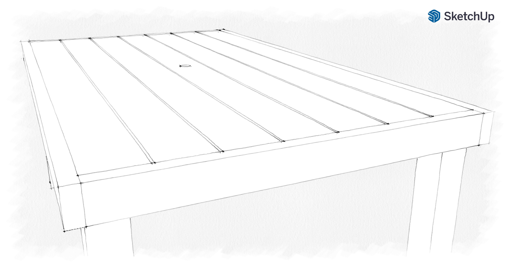

# Picnic Table

## Material List

- Table top
  - 4 count of 2" x 6" x 12'
- Frame
  - 3 count of 2" x 4" x 8'
- Braces
  - 1 count of 2" x 4" x 8'
- Legs
  - 2 count of 4" x 4" x 8'
- Fasteners
  - 52 count 3" deck screws
  - 8 count 3.5" deck screws
- Finish
  - stain
  - weather-proof top coat

## Tools

- 2 Saw horses
- 7 1/4" Circular Saw
- Drill / Impact Driver
- Clamps
- Pocket Hole Jig
- Orbital Sander